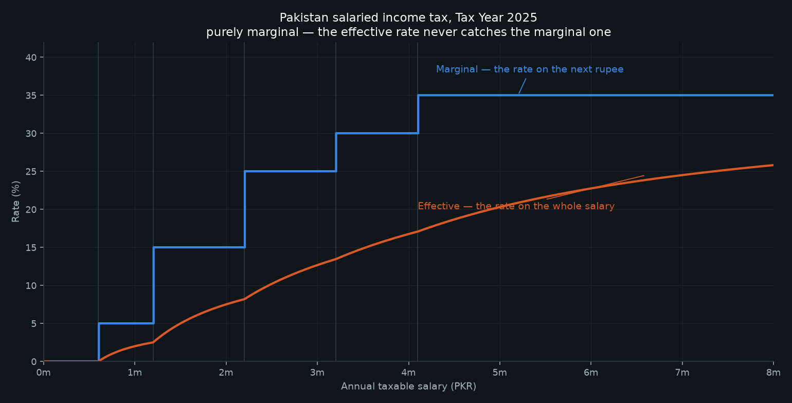
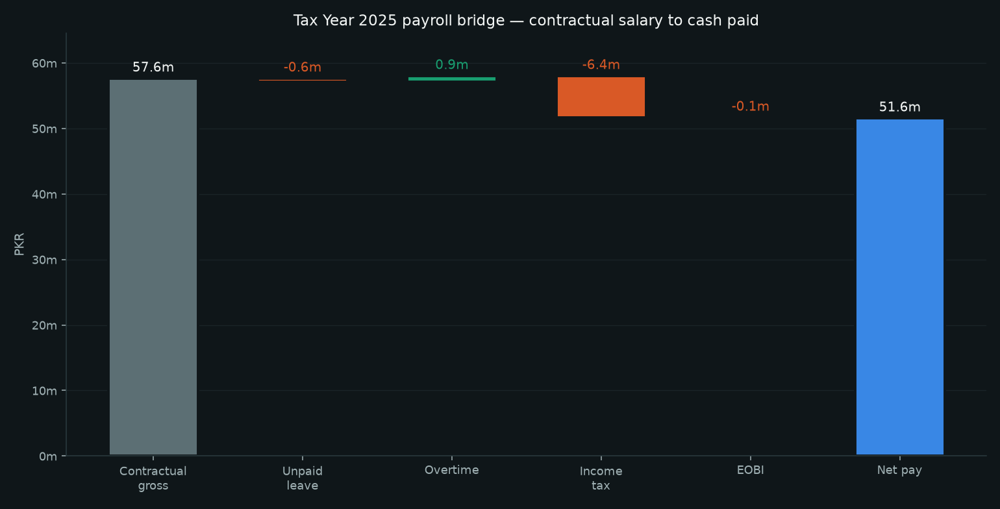
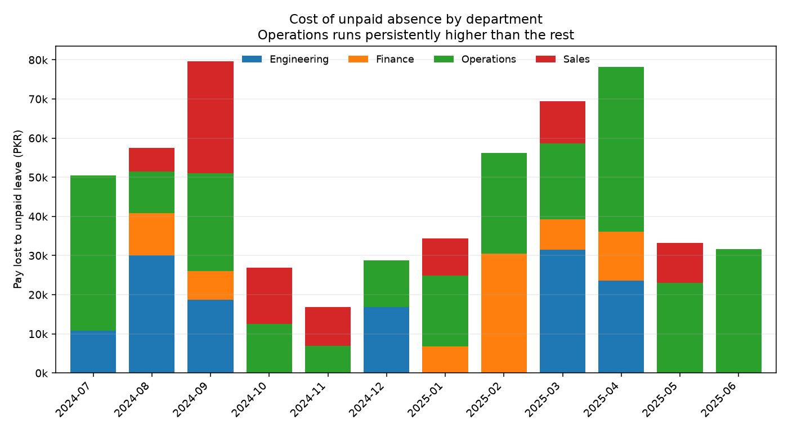
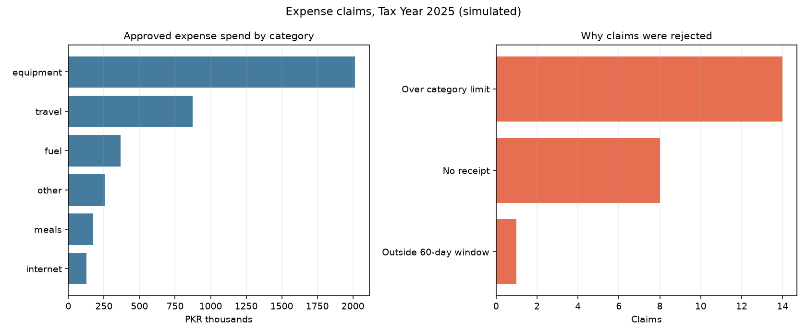
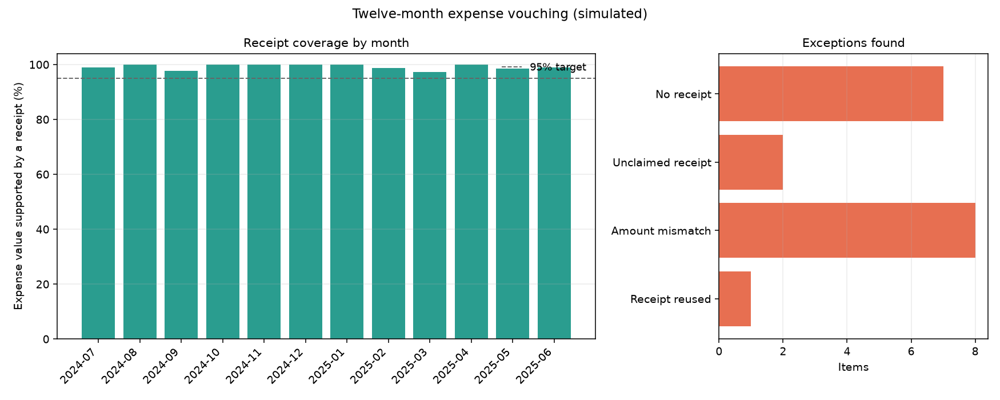

# Pakistan Payroll Analytics

A monthly payroll run for a Pakistani company, written as tested Python: salary
and attendance in, income tax and EOBI withheld, payslips and a reconciled
register out, plus an expense-claim policy engine. Built on the rules for
**Tax Year 2025** — 1 July 2024 to 30 June 2025, under the Finance Act 2024.

**Every employee, salary, absence and expense claim in this repository is
invented.** The names are common Pakistani names drawn at random and do not
refer to anyone. No data from any employer is used anywhere in this project.
The tax rules are real; the company is not. None of the figures below should be
read as a measured business result.

| Module | What it does | Tests |
|---|---|---:|
| [`payroll/tax.py`](payroll/tax.py) | TY2025 salaried slabs, surcharge, section 149 monthly withholding, marginal and effective rates | 14 |
| [`payroll/attendance.py`](payroll/attendance.py) | Working days to payable days; paid vs unpaid leave; overtime at 1.5× | 8 |
| [`payroll/payslip.py`](payroll/payslip.py) | Payslip, monthly register, EOBI, and a reconciliation that must pass before anything is paid | 5 |
| [`payroll/expenses.py`](payroll/expenses.py) | Category limits, receipt thresholds, a 60-day claim window, approval escalation | 9 |
| [`payroll/reconciliation.py`](payroll/reconciliation.py) | Cash book against bank statement: reference and window matching, unpresented cheques, deposits in transit, unrecorded bank items | 8 |
| [`payroll/vouchers.py`](payroll/vouchers.py) | Expense payment vouchers with segregation of duties — prepare, approve, disburse — approval limits and duplicate detection | 16 |
| [`payroll/vouching.py`](payroll/vouching.py) | Twelve months of expense lines matched to the receipt file: unvouched lines, unclaimed receipts, amount mismatches, receipts used twice | 18 |

```bash
py -3 -m unittest discover -s tests -t .   # 78 tests
py -3 report.py                            # runs the year, writes figures/
```

Tested with Python 3.13. Requires pandas and matplotlib for `report.py`; the
`payroll` package itself has no dependencies outside the standard library.

## The tax curve



Pakistan's salaried slabs are purely marginal, so unlike Ireland's USC there is
no income at which earning one more rupee leaves you worse off. `test_no_cliff_edges`
asserts exactly that across every slab boundary.

The fixed amounts in the slab table (30,000 / 180,000 / 430,000 / 700,000) are
not hard-coded twice: `test_fixed_amounts_are_consistent_with_rates` recomputes
each one from the marginal rates below it, so a typo in the table fails the
suite rather than quietly mispaying everyone.

## The payroll bridge



Contractual salary is not what reaches the bank. Across the simulated year:
PKR 57.6m contracted, 0.6m lost to unpaid absence, 0.9m added in overtime,
6.4m withheld in income tax and 0.1m in EOBI, leaving 51.6m paid.

Every one of the twelve monthly registers reconciles — earned gross less
deductions equals net pay, per employee and in total — and `report.py` refuses
to continue if a month does not tie.

## What attendance actually costs



| Department | Pay lost to unpaid leave | As % of that team's payroll |
|---|---:|---:|
| Operations | 266,725 | 2.79% |
| Engineering | 131,386 | 0.66% |
| Sales | 89,120 | 0.65% |
| Finance | 75,930 | 0.53% |

Operations loses four times the share the other teams do. That is the number a
manager can act on; a headline absence *rate* would not have shown the cost.

Paid leave does not reduce pay and unpaid leave is pro-rated on **working**
days, not calendar days — getting that wrong is one of the most common payroll
errors, so it has its own test.

## Why a mid-year raise costs more than it looks

One simulated employee gets a 35% raise in January. Their monthly tax deduction
**doubles**, rising 101%, because section 149 withholding spreads the whole
year's liability over twelve months and the raise pushes them from the 15% slab
into the 25% one. The employee sees a raise; their payslip shows a much larger
tax line than they expected.

This is the question payroll gets asked every time someone is promoted, and it
is why the engine withholds on annual contractual salary rather than on the
month in hand.

## Expense claims



266 claims across the year, 243 approved and 23 rejected (8.6%). Each rejection
carries a reason a claimant can be shown — over the category limit, missing a
receipt above PKR 5,000, outside the 60-day window, or dated before the expense
was incurred. Claims above PKR 50,000 escalate to the finance head rather than
a line manager.

Each check is tested by feeding it the specific error it exists to catch, which
is the only way to know a validation still validates.

## Bank reconciliation

A reconciliation is not "do the two balances match" — they almost never do, and
that is not an error. The question is whether every difference can be *named*.
Anything left unnamed is the thing worth looking at.

The matcher works in two passes: exact reference first, then amount within a
ten-day clearing window, because a cheque written on the 28th may not clear
until the 3rd. Reference matching runs first so that two payments of the same
value cannot be swapped by a coincidental amount match — which has its own test.

What is left over is classified rather than dumped in a list: payments in the
books that have not reached the bank (unpresented), lodgements the bank has not
yet credited (in transit), and items on the statement that never reached the
books at all — charges, interest, direct debits. That last group is the one
that needs a journal, and `check()` refuses to pass a reconciliation while any
remain. `stale_items()` flags reconciling items older than 30 days, which are
usually lost, never sent, or already replaced.

## Expense payment vouchers, and the control behind them

This is the internal control I designed and ran in practice, written down as
code:

```
prepare  ->  approve  ->  disburse
(finance)    (director)   (CEO)
```

No one person can move money alone. The person who raises the voucher cannot
approve it; the person who approves it cannot release the cash.

Most of `vouchers.py` is refusals, because a control that cannot say no is not
a control. It blocks:

- **self-approval** — the preparer approving their own voucher
- **the preparer or the approver releasing the payment**
- **disbursement before approval**
- **an amount edited after sign-off** — the approved figure is frozen at approval
  and re-checked at payment, so raising the amount after the director signs
  fails at the CEO gate
- **approval above the director's PKR 100,000 authority** without the CEO
- **a voucher with no narrative**, which cannot be approved on its face
- **back-dating** — approving before the voucher was raised, or paying before
  it was approved

`find_duplicate_payments()` catches the classic double payment: same payee,
same amount, inside thirty days. `control_summary()` reports the segregation
rate across disbursed vouchers, which is the evidence an auditor actually asks
for — not that the control exists, but that it operated.

## Twelve months of expenses, matched to the receipts



A policy check asks whether a claim was *allowed*. Vouching asks whether a
document actually exists behind the money that left — a different question, and
the one an auditor puts first.

Across the simulated year: **244 expense lines, 238 receipts, 99.1% of claimed
value supported by a receipt**, and 18 exceptions to follow up.

Coverage is measured **by value, not by count**, because nine small vouched
claims do not offset one large unsupported one. There is a test that asserts
exactly that: nine PKR 1,000 vouched lines against one PKR 91,000 unvouched one
scores 9%, not 90%.

Four things can go wrong and each is a different problem:

- **a line with no receipt** — an unsupported payment
- **a receipt nobody claimed** — a cost that may never have been recorded
- **claim and receipt disagree** — an over- or under-claim
- **one receipt on two lines** — the same cost paid twice

The last is the one worth catching, because it looks clean on every other
report: the claim is within policy, the amount matches a real document, the
approval trail is complete. Only matching receipt numbers across the full year
finds it. The exceptions report puts duplicates first for that reason.

## Sources for the tax rules

TY2025 salaried slabs are those introduced by the Finance Act 2024, effective
1 July 2024 to 30 June 2025. Rates were changed again by the Finance Act 2025
for TY2026 (the 5% band fell to 1%, and 15% to 11%), so this engine is
deliberately pinned to TY2025 and the slab table is versioned data rather than
constants scattered through the code.

Slabs cross-checked against [PwC Worldwide Tax Summaries](https://taxsummaries.pwc.com/pakistan/individual/taxes-on-personal-income),
[Befiler](https://www.befiler.com/blog/income-tax-slabs-2024-2025) and
[EY's Finance Bill 2024 alert](https://www.ey.com/en_gl/technical/tax-alerts/pakistan-s-2024-finance-bill-proposes-indirect--individual--corp).
This is a model of the rules, not tax advice, and nobody should file from it.

## Background

I ran monthly payroll, company and individual taxation, expense control and
attendance reporting as Finance Associate at NaqCoDE Technologies from October
2024 to August 2025 — the same tax year this engine models. That work stayed on
the company's systems and none of it appears here. This project rebuilds the
same problems from scratch on invented data so the method can be shown without
disclosing anything about a former employer or its staff.
